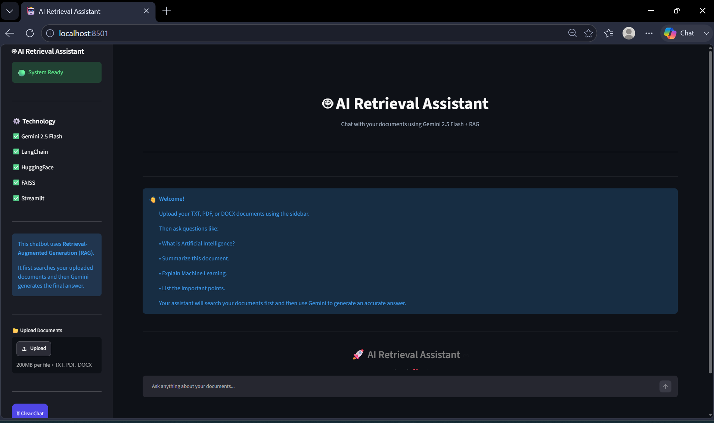
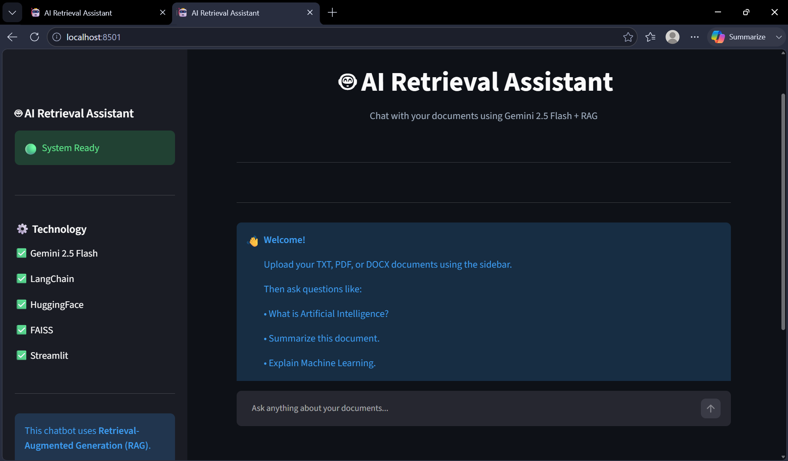
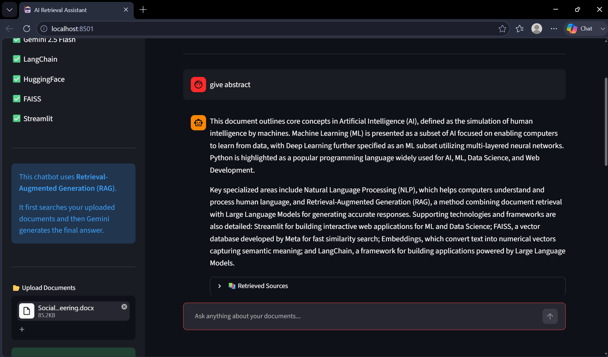
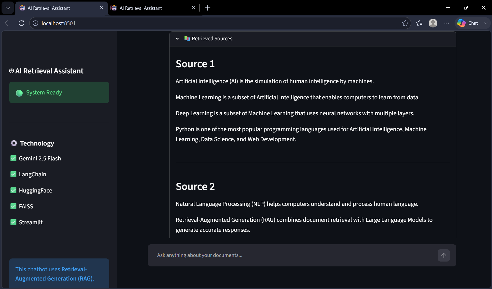

#  AI Retrieval Assistant

<p align="center">
  
</p>

<p align="center">


</p>

---

#  Overview

AI Retrieval Assistant is an intelligent chatbot that answers questions using your own documents instead of relying only on the Large Language Model.

The application uses **Retrieval-Augmented Generation (RAG)** to retrieve relevant document chunks from a FAISS vector database before sending context to **Google Gemini 2.5 Flash**.

This enables:

- Accurate document-based answers
- Fast semantic search
- Multi-document support
- Source citations
- Beautiful chat interface

---

#  Features

✅ Google Gemini 2.5 Flash Integration

✅ Retrieval-Augmented Generation (RAG)

✅ LangChain Framework

✅ FAISS Vector Database

✅ HuggingFace Embeddings

✅ Upload TXT Documents

✅ Upload PDF Documents

✅ Upload DOCX Documents

✅ Source References

✅ Semantic Search

✅ Chat History

✅ Statistics Dashboard

✅ Beautiful Dark UI

✅ Responsive Layout

✅ Ready for Deployment

---

#  Architecture

```
               User
                 │
                 ▼
        Upload Documents
                 │
                 ▼
      Document Loader (TXT/PDF/DOCX)
                 │
                 ▼
        Text Chunking
                 │
                 ▼
 HuggingFace Embeddings Model
                 │
                 ▼
        FAISS Vector Database
                 │
      Similarity Search
                 │
                 ▼
 Relevant Document Chunks
                 │
                 ▼
      Google Gemini 2.5 Flash
                 │
                 ▼
        Final AI Response
```

---

# 🖼 Screenshots

##  Home



---

##  Upload Documents


---

##  Chat Interface



---

##  Retrieved Sources



---

# ⚙ Technologies Used

| Technology | Purpose |
|------------|----------|
| Python | Backend |
| Streamlit | Web Interface |
| LangChain | RAG Pipeline |
| FAISS | Vector Database |
| HuggingFace | Embedding Model |
| Google Gemini 2.5 Flash | LLM |
| Sentence Transformers | Text Embeddings |

---

#  Project Structure

```
chatbot-with-retrieval/
│
├── assets/
│   ├── banner.png
│   ├── logo.png
│   └── screenshots/
│       ├── home.png
│       ├── upload.png
│       ├── chat.png
│       └── source.png
│
├── documents/
│
├── vectorstore/
│
├── app.py
├── ingest.py
├── config.py
├── requirements.txt
├── README.md
├── .env.example
└── .gitignore
```

---

#  Installation

Clone the repository

```bash
git clone https://github.com/YOUR_USERNAME/chatbot-with-retrieval.git

cd chatbot-with-retrieval
```

Install dependencies

```bash
python -m pip install -r requirements.txt
```

---

#  Configure API Key

Create a `.env` file

```env
GOOGLE_API_KEY=YOUR_GEMINI_API_KEY
```

---

#  Build the Vector Database

```bash
python ingest.py
```

---

# ▶ Run the Application

```bash
python -m streamlit run app.py
```

---

#  Example Questions

- What is Artificial Intelligence?
- Summarize this document.
- Explain Machine Learning.
- List important points.
- Give an abstract.
- Explain the conclusion.
- What are the advantages?
- Compare AI and ML.

---

#  RAG Workflow

```
Upload File
      │
      ▼
Document Loader
      │
      ▼
Chunking
      │
      ▼
Embeddings
      │
      ▼
FAISS
      │
Similarity Search
      │
      ▼
Gemini
      │
      ▼
Answer + Sources
```

---

#  Future Improvements

- Voice Chat
- Image Upload
- OCR Support
- Multi-language Support
- User Authentication
- Conversation Export
- Docker Deployment
- Cloud Database
- Streaming Responses
- Chat Memory

---

#  License

This project is licensed under the MIT License.

---

#  Developer

**Chandu Venkata Pavan**

GitHub:
https://github.com/cchanduvenkatpavan33

LinkedIn:
https://www.linkedin.com/in/chanduvenkatpavanchadive33?utm_source=share_via&utm_content=profile&utm_medium=member_android

---

# ⭐ Support

If you found this project useful,

⭐ Star the repository

🍴 Fork it

🛠 Contribute improvements

---

<p align="center">

Made with ❤️ using

**Streamlit • LangChain • FAISS • HuggingFace • Google Gemini 2.5 Flash**

</p>